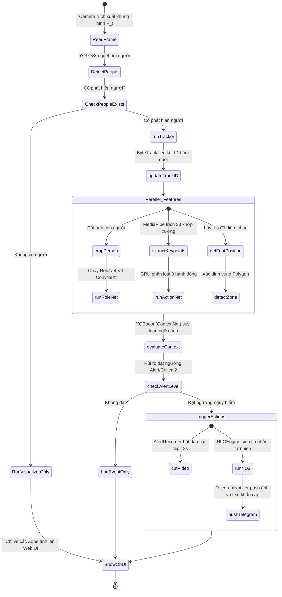
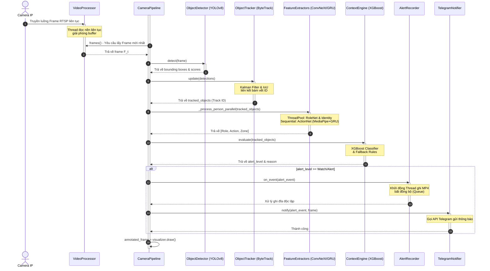

# CHƯƠNG 1: CƠ SỞ ĐỀ TÀI VÀ PHÂN TÍCH THIẾT KẾ

## 1.1. Yêu cầu bài toán thực tiễn

Trong thời đại Internet vạn vật (IoT) và Trí tuệ nhân tạo (AI) đang định hình lại toàn bộ các giải pháp công nghệ, việc xây dựng một hệ thống giám sát an ninh thông minh không chỉ là một bài toán nghiên cứu hàn lâm mà là một nhu cầu vô cùng cấp thiết và có giá trị thương mại hóa cao. Để đáp ứng tốt bối cảnh thực tế tại Việt Nam, hệ thống cần thỏa mãn đồng thời hai nhóm yêu cầu nghiêm ngặt dưới đây:

### 1.1.1. Yêu cầu chức năng (Functional Requirements)

Hệ thống camera an ninh thông minh hiểu ngữ cảnh được thiết kế như một đường ống xử lý (Pipeline) thời gian thực khép kín, đảm nhiệm trọn vẹn chuỗi chức năng từ thu nhận hình ảnh thô cho đến khi tương tác trực tiếp với người dùng:

1.  **Phát hiện và Theo dấu đối tượng liên tục (Object Detection & Multi-Object Tracking):**
    *   Hệ thống phải tự động phát hiện sự xuất hiện của con người (lớp "person") trong từng khung hình video với độ chính xác cao, ngay cả khi đối tượng bị che khuất một phần (occlusion), mờ nhòe do di chuyển nhanh (motion blur) hoặc đứng ở khoảng cách xa camera.
    *   Tự động bám vết và gán một mã định danh nhất quán (Track ID) cho từng đối tượng. Mã bám vết này phải được duy trì ổn định trong suốt hành trình đối tượng di chuyển trong tầm quan sát của camera, tạo tiền đề để phân tích các hành vi mang tính chuỗi thời gian (time-series).
2.  **Nhận diện vai trò xã hội thông minh (Role Classification):**
    *   Hệ thống có khả năng phân tích các vùng ảnh chứa đối tượng (crop person) để nhận diện vai trò xã hội dựa trên trang phục đặc trưng và công cụ mang theo.
    *   Hệ thống được thiết kế tối ưu để phân loại chính xác các vai trò xã hội phổ biến trong môi trường sống tại Việt Nam bao gồm: Nhân viên giao hàng (Shipper - với trang phục Grab màu xanh lá, Shopee/SPX màu cam, Viettel Post màu đỏ...), Công nhân xây dựng (Construction worker - mặc áo bảo hộ phản quang, đội mũ bảo hộ lao động cứng), Cảnh sát/Bảo vệ (Police/Security - mặc sắc phục chuyên ngành), Đầu bếp (Chef), Nhân viên vệ sinh (Janitor), Người nhà (Family member - dựa trên nhận diện dáng vẻ quen thuộc) và Người lạ (Stranger - các đối tượng không xác định mặc thường phục).
3.  **Nhận diện hành vi động thời gian thực (Action Recognition):**
    *   Hệ thống có khả năng ước lượng dáng người và trích xuất tọa độ các khớp xương cơ thể (dưới dạng bộ khung xương phẳng 2D/3D).
    *   Dựa trên chuỗi tọa độ khớp xương tích lũy liên tục qua các khung hình, hệ thống phân tích và phân loại chính xác các hành động động: Đi bộ (Walking), Đứng yên (Standing), Chạy nhanh (Running), Leo trèo (Climbing), Ngã quỵ/Ngất xỉu (Falling), Đánh nhau (Fighting), Giơ tay cầu cứu (Raising hand) và Tụ tập đông người (Gathering).
4.  **Cấu hình và Quản lý vùng giám sát ảo (Zone Management):**
    *   Cung cấp giao diện trực quan cho phép người dùng tự vẽ các đa giác vùng (Polygon Zones) với số đỉnh tùy ý trực tiếp trên luồng camera.
    *   Hệ thống có khả năng quản lý và phân loại các vùng giám sát với các thuộc tính bảo vệ khác nhau (ví dụ: Vùng cấm - Restricted Area như ban công, tường rào, cửa sau; Vùng đệm - Entrance như sân trước, cổng chính; Vùng tự do - Public Area như vỉa hè ngoài đường).
    *   Tự động đối chiếu điểm chân (footprint coordinates) của đối tượng để xác định tức thì đối tượng đang đứng ở vùng nào trong thời gian thực.
5.  **Động cơ phân tích ngữ cảnh và Quyết định mức độ rủi ro (Context reasoning & Decision engine):**
    *   Đây là "bộ não" trung tâm chịu trách nhiệm tổng hợp thông tin đa chiều: *Vai trò (Role) + Hành động (Action) + Vị trí (Zone) + Thời gian (Time)* để đưa ra đánh giá rủi ro an ninh tổng thể.
    *   Phân loại ngữ cảnh thành 6 cấp độ rủi ro rõ ràng:
        *   `Ignore` / `Normal`: Mức an toàn tuyệt đối, không có mối nguy hiểm (ví dụ: người nhà đi bộ trong sân ban ngày).
        *   `Watch` / `Warning`: Mức độ cần chú ý, theo dõi nhẹ (ví dụ: shipper đứng trước cổng chính đợi giao hàng).
        *   `Alert` / `Critical`: Mức độ nguy hiểm cao, đe dọa trực tiếp đến an ninh (ví dụ: kẻ lạ đứng lảng vảng tại ban công lúc nửa đêm, hoặc phát hiện có người ngã quỵ/đánh nhau trong sân vườn).
6.  **Sinh ngôn ngữ tự nhiên và Gửi cảnh báo (Natural Language Generation & Alerting):**
    *   Khi phát hiện sự kiện vượt ngưỡng an toàn (Alert/Critical), hệ thống tự động dịch thông tin sự kiện kỹ thuật khô khan (ví dụ: *stranger in zone_1 running*) thành một câu thông báo tiếng Việt ngắn gọn, giàu sắc thái cảm xúc và tự nhiên như tin nhắn trò chuyện thông qua bot Telegram (ví dụ: *"🚨 Cảnh báo bạn ơi! Có một người lạ mặt đang chạy rất nhanh tại khu vực Cổng chính đó! Hãy kiểm tra ngay!"*).
7.  **Ghi hình sự kiện thông minh (Event Recording):**
    *   Tự động kích hoạt cơ chế ghi hình cắt video ngắn dài từ 10 - 15 giây lưu trữ riêng trên thư mục `recordings/` khi xảy ra cảnh báo nguy hiểm. File video phải bao gồm cả 5 giây đệm trước khi sự kiện diễn ra (pre-buffer) để đảm bảo ghi nhận trọn vẹn hành trình tiếp cận của đối tượng.

---

### 1.1.2. Yêu cầu phi chức năng (Non-Functional Requirements)

Bên cạnh các tính năng nghiệp vụ, hệ thống bắt buộc phải đáp ứng các tiêu chuẩn kỹ thuật nghiêm ngặt để đảm bảo khả năng hoạt động ổn định và tin cậy trong môi trường thực tế:

*Bảng 1.1: Yêu cầu phi chức năng của hệ thống Camera AI*

| Tiêu chuẩn kỹ thuật | Chỉ số yêu cầu (KPI) | Lý do thực tế |
| :--- | :--- | :--- |
| **Tốc độ xử lý (Real-time FPS)** | Đạt ổn định **12 - 15 FPS** khi có nhiều đối tượng phức tạp (3+ người); và đạt **25 - 30 FPS** trong điều kiện bình thường trên cấu hình CPU/GPU tầm trung. | Khung hình không được giật lag để thuật toán bám đuổi (tracker) không bị mất dấu đối tượng di chuyển nhanh. |
| **Độ trễ hệ thống (Latency)** | Tổng thời gian từ lúc sự kiện nguy hiểm xảy ra ngoài thực tế đến khi tin nhắn Telegram báo về điện thoại **không quá 2.5 giây**. | Cảnh báo kịp thời giúp người dùng có cơ hội ngăn chặn hành vi phạm tội ngay lập tức thay vì chỉ xem lại bằng chứng. |
| **Độ ổn định hệ thống (Reliability)** | Hoạt động liên tục **24/7**, tự động kết nối lại luồng video camera (auto-reconnect) khi mất kết nối mạng hoặc mất nguồn camera tạm thời. | Hệ thống an ninh không được phép gián đoạn hoạt động, đặc biệt vào ban đêm khi nguy cơ xâm nhập cao nhất. |
| **Hiệu quả tài nguyên (Efficiency)** | RAM sử dụng dưới **1.5 GB**, CPU load dưới **65%** trên cấu hình CPU 8 nhân phổ thông. Không bị rò rỉ bộ nhớ (memory leaks). | Hệ thống có thể chạy bền bỉ trên các máy tính mini giá rẻ hoặc máy tính gia đình mà không gây đứng máy, nghẽn mạng. |
| **Độ bảo mật (Security)** | API được phân quyền, các file ghi hình sự kiện (`recordings/`) được lưu trữ cục bộ bảo mật, truyền tải thông tin qua HTTPS/WSS. | Đảm bảo dữ liệu hình ảnh nhạy cảm của gia đình không bị rò rỉ ra internet hoặc bị hacker can thiệp. |

---

## 1.2. Tại sao cần hệ thống "hiểu ngữ cảnh" (Context-aware)?

### 1.2.1. Sự thiếu sót của hệ thống phát hiện chuyển động thông thường

Hầu hết các camera giám sát hiện nay trên thị trường (kể cả các dòng camera thương mại được quảng cáo tích hợp AI phát hiện con người) vẫn vận hành dựa trên các nguyên lý so sánh pixel thô sơ (Frame Differencing) hoặc phân tích sự thay đổi dòng quang học (Optical Flow). Hệ thống liên tục đo đạc sự biến thiên màu sắc và cường độ sáng của các điểm ảnh giữa các khung hình liên tiếp.

**Hậu quả thực tế:**
*   Hệ thống hoàn toàn "mù lòa" trước ngữ cảnh thực tế. Nó không thể phân biệt được đâu là một chuyển động vật lý vô hại do môi trường tự nhiên gây ra (gió thổi rèm cửa đung đưa, lá cây rụng trước sân, bóng mây đi ngang qua, trời mưa lớn, chó mèo chạy nhảy) và đâu là chuyển động nguy hiểm thực sự của con người.
*   **Hội chứng lờn cảnh báo (Alarm Fatigue):** Tần suất báo động sai quá dày đặc (lên tới hàng trăm tin nhắn rác mỗi ngày trong những ngày mưa bão) gây ức chế tâm lý cực kỳ nặng nề cho người sử dụng. Hậu quả là phần lớn người dùng quyết định tắt bỏ hoàn toàn tính năng cảnh báo của camera. Khi có kẻ gian đột nhập thực tế, hệ thống hoàn toàn mất đi tác dụng bảo vệ an ninh.

---

### 1.2.2. Sự khác biệt cốt lõi: Kết hợp đa yếu tố tạo nên Trí tuệ ngữ cảnh

Sự vượt trội mang tính cách mạng của một hệ thống **Hiểu ngữ cảnh (Context-aware)** nằm ở việc mô phỏng tư duy đánh giá rủi ro sắc sảo của một nhân viên an ninh chuyên nghiệp. Hệ thống không đưa ra phán quyết dựa trên một chuyển động đơn lẻ mà phân tích mối liên hệ logic chặt chẽ giữa ba trục thông tin:

$$\text{Ngữ cảnh Rủi ro} = f(\text{Vai trò của Ai?}, \text{Hành động gì?}, \text{Vị trí ở đâu?})$$

Sự kết hợp logic đa chiều này tạo nên một hệ thống thông minh, tự động lọc bỏ các báo động giả vô hại và nhận diện chính xác tuyệt đối các mối đe dọa thực tế thông qua các tình huống đối chiếu điển hình sau:

1.  **Tình huống A (Bình thường - Normal):**
    *   *Tổ hợp:* `Normal Person` + `Walking` + `Yard` (Một người bình thường đang đi bộ trong sân vườn).
    *   *Logic:* Hệ thống đánh giá đây là sinh hoạt gia đình vô hại. Nhật ký được ghi nhận âm thầm, không phát bất kỳ thông báo nào lên điện thoại chủ nhà.
2.  **Tình huống B (Theo dõi - Watch):**
    *   *Tổ hợp:* `Shipper` + `Standing` + `Entrance` (Nhân viên shipper đang đứng ở trước cổng chính).
    *   *Logic:* Hệ thống hiểu đây là hoạt động giao hàng bình thường. Gửi một tin nhắn Telegram nhẹ nhàng: *"Ting tong! Có anh Shipper giao đồ vừa đến ở cổng kìa bạn ơi!"* để chủ nhà chủ động ra nhận hàng.
3.  **Tình huống C (Cảnh báo - Warning):**
    *   *Tổ hợp:* `Construction Worker` + `Walking` + `Zone_1` (Công nhân xây dựng đang đi lại trong vùng giám sát thi công).
    *   *Logic:* Hệ thống nhận diện đúng vai trò công nhân để phục vụ bài toán giám sát an toàn lao động tại công trường nhỏ, gửi thông báo cảnh báo nhẹ để giám sát tiến độ.
4.  **Tình huống D (Nguy hiểm khẩn cấp - Critical Alert):**
    *   *Tổ hợp:* `Stranger` + `Standing/Loitering` + `Restricted Area` (Kẻ lạ mặt đeo khẩu trang đứng lảng vảng ở vùng cấm cửa sau nhà lúc nửa đêm).
    *   *Logic:* Hệ thống lập tức chấm điểm rủi ro tối đa. Còi báo động tại chỗ hú vang, camera cắt ngay clip 12 giây bám theo đối tượng, gửi tin nhắn khẩn cấp màu đỏ tới Telegram chủ nhà: *"🚨 CẢNH BÁO NGUY HIỂM! Phát hiện kẻ lạ mặt đang đứng lảng vảng đáng ngờ tại vùng cấm cửa sau! Hãy kiểm tra camera lập tức!"*

Chính khả năng suy luận ngữ cảnh đa yếu tố này giúp hệ thống loại bỏ hơn 90% báo động rác, đồng thời phản ứng lập tức và chính xác trước mọi mối nguy hiểm an ninh thực sự.

---

## 1.3. Giới hạn và phạm vi của đồ án

Để đảm bảo đề tài có tính khả thi cao, được hoàn thiện một cách chỉn chu nhất và hoạt động cực kỳ ổn định trong thực tế, nhóm thực hiện đồ án đã khoanh vùng và xác định rõ các giới hạn triển khai kỹ thuật sau:

1.  **Phạm vi phân loại Vai trò xã hội (16 Roles):** Hệ thống tập trung tối ưu hóa nhận diện chính xác **16 vai trò** phổ biến đặc trưng trong bối cảnh đời sống Việt Nam bao gồm: *Người lạ (Stranger), Người thường (Normal), Nhân viên giao hàng (Shipper), Công nhân (Worker/Construction worker), Cảnh sát (Police), Quân đội (Military), Bảo vệ (Security), Sinh viên (Student), Đầu bếp (Chef), Lao công (Janitor), Y tá/Bác sĩ (Nurse/Doctor), Người đưa thư (Postman), Kỹ thuật viên (Technician)...* Nhận diện chủ yếu dựa trên trang phục bảo hộ, đồng phục các hãng công nghệ phổ biến hoặc sắc phục chuyên ngành.
2.  **Phạm vi nhận diện Hành vi dáng người (8 Actions):** Hệ thống tập trung nhận diện chính xác **8 hành vi** vận động cơ bản có tác động trực tiếp tới bài toán an ninh: *Đứng yên (Standing), Đi bộ (Walking), Chạy (Running), Ngã quỵ (Falling), Leo trèo (Climbing), Đánh nhau (Fighting), Giơ tay cầu cứu (Raising hand), Tụ tập đông người (Gathering).* Các hành vi vi mô đòi hỏi biểu cảm khuôn mặt hay cử động ngón tay nhỏ tạm thời nằm ngoài phạm vi phân tích khớp xương phẳng của đồ án này.
3.  **Phạm vi kiến trúc Xử lý Video:** Hệ thống hiện tại được thiết kế và tối ưu tốt nhất cho kiến trúc **Đơn luồng Camera (Single Stream)** từ camera IP hoặc webcam gia đình với độ phân giải tiêu chuẩn HD (720p) hoặc Full HD (1080p). Việc mở rộng xử lý đồng thời hàng chục luồng camera (Multi-camera stream) sẽ được đề xuất trong hướng phát triển tương lai.
4.  **Phạm vi môi trường ánh sáng:** Hệ thống hoạt động tốt nhất trong điều kiện ban ngày đầy đủ ánh sáng tự nhiên hoặc môi trường ban đêm có hệ thống đèn chiếu sáng hỗ trợ đầy đủ. Đối với môi trường tối đen hoàn toàn không có ánh sáng nhân tạo hỗ trợ (khi camera bắt buộc phải chuyển sang chế độ hồng ngoại trắng đen - làm mất đi hoàn toàn yếu tố màu sắc trang phục đặc trưng của mô hình nhận diện vai trò), độ chính xác phân loại vai trò xã hội của hệ thống sẽ bị suy giảm rõ rệt.
5.  **Phạm vi tối ưu hóa phần cứng:** Dự án tập trung vào hướng tiếp cận tối ưu hóa phần mềm để hệ thống hoạt động mượt mà thời gian thực trên các dòng máy tính cá nhân phổ thông (chỉ cần CPU đa nhân kết hợp GPU rời tầm trung hoặc thậm chí chạy hoàn toàn trên CPU thông qua lượng hóa ONNX INT8) mà không yêu cầu các cấu hình máy chủ AI chuyên dụng đắt đỏ.

---

## 1.4. Phân tích & Thiết kế Hệ thống theo chuẩn UML

Để có thể tổ chức và phát triển một hệ thống phần mềm lớn, phức tạp và chạy thời gian thực một cách khoa học, nhóm đã tiến hành phân tích thiết kế hệ thống kỹ lưỡng thông qua các biểu đồ mô hình hóa ngôn ngữ UML tiêu chuẩn.

### 1.4.1. Biểu đồ Ca sử dụng (Use Case Diagram & Specifications)

Hệ thống có hai tác nhân chính (Actors) tương tác trực tiếp là: **Chủ nhà / Admin (User)** - tương tác cấu hình hệ thống và nhận kết quả, và **Kẻ xâm nhập / Đối tượng di chuyển (Actor/Target)** - đối tượng sinh ra dữ liệu camera. Bên cạnh đó là các hệ thống dịch vụ bên thứ ba (System Actors) bao gồm **Camera Stream** (nguồn cung cấp frame) và **Telegram API Server** (kênh trung gian push cảnh báo).

```mermaid
  left_to_right_direction
  actor User as "Chủ nhà / Admin"
  actor Target as "Đối tượng di chuyển"
  actor Camera as "Camera Stream"
  actor Telegram as "Telegram API"

  rectangle "Hệ thống Camera AI hiểu ngữ cảnh" {
    usecase UC1 as "Xem video Live Stream"
    usecase UC2 as "Vẽ và Cấu hình Vùng ảo"
    usecase UC3 as "Nhận cảnh báo tự nhiên"
    usecase UC4 as "Cấu hình Telegram Bot"
    usecase UC5 as "Tải video sự kiện"
    usecase UC6 as "Phân tích và Hiểu ngữ cảnh"
    usecase UC7 as "Ghi hình cắt clip tự động"
  }

  User --> UC1
  User --> UC2
  User --> UC3
  User --> UC4
  User --> UC5

  Target --> UC6
  Camera --> UC1
  Camera --> UC6

  UC6 --> UC7
  UC6 --> UC3
  UC3 --> Telegram
  UC7 --> UC5
```

*Bảng 1.2: Đặc tả chi tiết Use Case "Nhận cảnh báo tự nhiên và ghi hình"*

| Mục mô tả | Nội dung đặc tả |
| :--- | :--- |
| **Tên Use Case** | **Nhận cảnh báo tự nhiên và ghi hình tự động (UC3 & UC7)** |
| **Tác nhân chính**| Chủ nhà / Admin (User), Telegram API, AlertRecorder |
| **Mô tả ngắn** | Hệ thống phát hiện đối tượng con người, phân tích ngữ cảnh rủi ro. Nếu phát hiện nguy hiểm, hệ thống tự động sinh tin nhắn văn bản tự nhiên, cắt clip 13 giây nén gửi qua Telegram tới chủ nhà. |
| **Điều kiện tiên quyết** | Hệ thống CameraPipeline đang hoạt động mượt mà thời gian thực, kết nối internet ổn định, API Telegram đã được thiết lập đúng. |
| **Luồng sự kiện chính (Basic Flow)** | 1. Hệ thống phát hiện con người đi vào vùng cấm.<br/>2. `ContextEngine` đánh giá cấp độ rủi ro đạt mức `Critical`.<br/>3. Kích hoạt `AlertRecorder` lấy 5 giây pre-buffer và tiếp tục ghi thêm 8 giây bối cảnh.<br/>4. `NLGEngine` gọi Gemini API (hoặc fallback) dịch bối cảnh thành câu văn tự nhiên tiếng Việt.<br/>5. `TelegramNotifier` gửi tin nhắn văn bản + ảnh snapshot khuôn mặt đối tượng qua API Telegram.<br/>6. Khi ghi xong clip 13 giây, bot gửi tiếp clip MP4 lên điện thoại người dùng. |
| **Luồng ngoại lệ (Exceptions)**| - *Mất kết nối internet:* Hệ thống tự động chuyển NLG sang bộ Fallback tiếng Việt cục bộ, lưu trữ clip sự kiện offline trong máy đợi có mạng để đồng bộ.<br/>- *Vượt ngưỡng giới hạn cuộc gọi:* Cooldown 20 giây per-track tự động kích hoạt lọc bỏ spam. |

---

### 1.4.2. Biểu đồ Hoạt động (Activity Diagram)

Biểu đồ hoạt động mô tả chi tiết luồng nghiệp vụ động diễn ra bên trong đường ống Pipeline xử lý của hệ thống tại mỗi chu kỳ khung hình (frame cycle):



---

### 1.4.3. Biểu đồ Tuần tự hệ thống (Sequence Diagram)

Biểu đồ tuần tự dưới đây thể hiện sự tương tác, truyền tin và điều phối theo trục thời gian của 8 lớp đối tượng lập trình chính cấu thành nên kiến trúc mã nguồn trong Pipeline xử lý:


