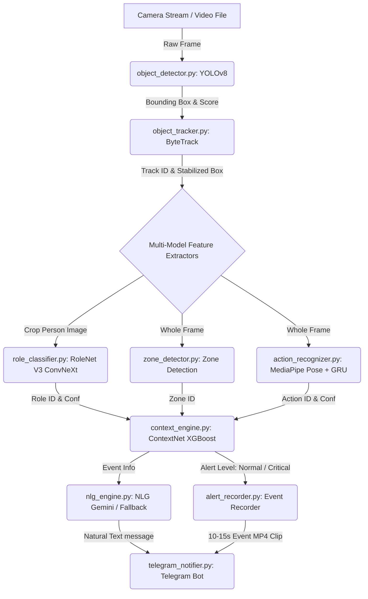
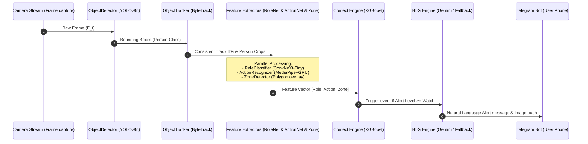
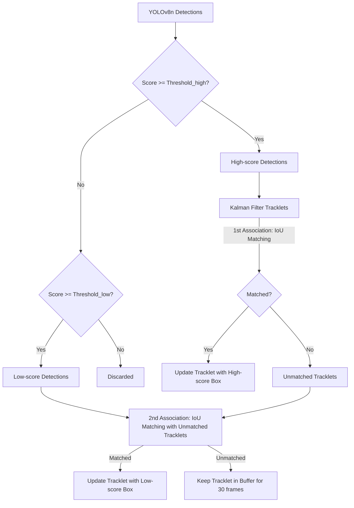
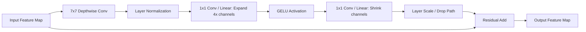
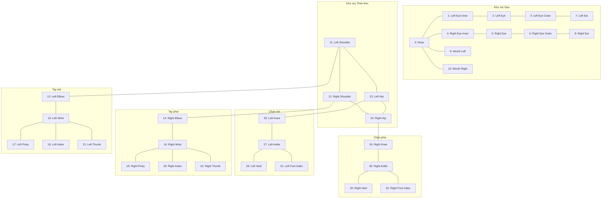
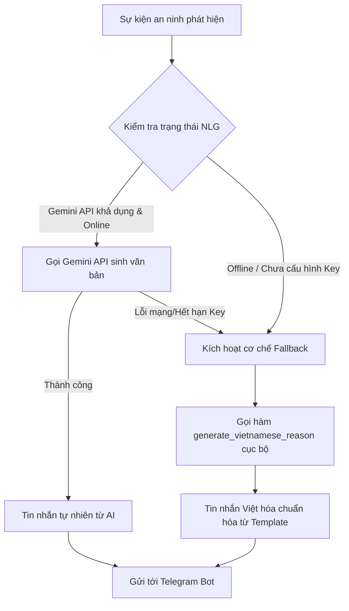

# CHƯƠNG 2: THIẾT KẾ VÀ XÂY DỰNG HỆ THỐNG

## 2.1. Cấu trúc và luồng hoạt động tổng thể (Pipeline)

Hệ thống được thiết kế theo kiến trúc đường ống (Pipeline) thời gian thực khép kín, tối ưu hóa cho việc suy luận đa mô hình đồng thời (Multi-model Inference) mà vẫn duy trì được độ trễ thấp và FPS ổn định. 

---

### 2.1.1. Sơ đồ khối kiến trúc hệ thống tổng thể

Kiến trúc hệ thống bao gồm 4 khối chức năng chính được liên kết tuần tự chặt chẽ:




*Hình 2.1: Sơ đồ khối kiến trúc hệ thống tổng thể (Real-time Pipeline)*

1.  **Khối Thu Nhận & Tiền Xử Lý (Ingestion Block):** Đảm nhiệm bởi `video_processor.py`. Khối này kết nối trực tiếp tới luồng RTSP của Camera IP hoặc đọc file video thử nghiệm, trích xuất từng Frame ảnh thô, resize về kích thước chuẩn và đưa vào hàng đợi xử lý.
2.  **Khối Phát Hiện & Bám Đuổi (Detection & Tracking Block):** Sử dụng sự kết hợp giữa mô hình YOLOv8 (`object_detector.py`) để phát hiện đối tượng con người và thuật toán ByteTrack (`object_tracker.py`) để duy trì mã định danh đối tượng (Track ID) liên tục qua các khung hình.
3.  **Khối Trích Xuất Đặc Trưng Đa Luồng (Feature Extractors):** Khi một Track ID con người được xác nhận hoạt động ổn định, hệ thống sẽ song song kích hoạt ba nhánh phân tích:
    *   **Nhận diện vai trò (`role_classifier.py`):** Cắt vùng ảnh chứa con người (Crop) làm đầu vào cho mô hình **RoleNet V3** để phân tích trang phục, mũ bảo hiểm, túi xách nhằm suy luận ra vai trò xã hội.
    *   **Xác định vùng tọa độ (`zone_detector.py`):** Đối chiếu tọa độ điểm chân của đối tượng với các đa giác vùng (Polygon Zones) được người dùng vẽ trên giao diện giám sát để gán nhãn khu vực hoạt động (`zone_id`).
    *   **Nhận diện hành động (`action_recognizer.py`):** Trích xuất tọa độ 33 điểm khớp xương cơ thể thông qua MediaPipe Pose và đưa chuỗi thời gian (15-30 frames) vào mạng GRU (**ActionNet**) để nhận diện hành vi động.
4.  **Khối Động Cơ Quyết Định & NLG (Decision & Generative Block):**
    *   Động cơ ngữ cảnh (`context_engine.py` / `context_engine_ml.py`) nhận dữ liệu đầu vào gồm *Role + Action + Zone* để đưa ra đánh giá cấp độ nguy hiểm.
    *   Khi mức nguy hiểm vượt quá ngưỡng an toàn, hệ thống kích hoạt bộ ghi hình sự kiện (`alert_recorder.py`) để xuất file video clip ngắn ghi lại bối cảnh, đồng thời chuyển thông tin sự kiện sang **NLG Engine** (`nlg_engine.py`) để sinh nội dung tin nhắn tự nhiên gửi qua bot Telegram (`telegram_notifier.py`).

---

### 2.1.2. Luồng dữ liệu (Data flow) từ Frame ảnh đến Cảnh báo

Hành trình di chuyển của dòng dữ liệu từ một khung hình thô của camera đến khi người dùng nhận được tin nhắn trên điện thoại được diễn ra như sau:

1.  **Bước 1 (Frame capture):** `VideoProcessor` chụp frame $F_t$ tại thời điểm $t$.
2.  **Bước 2 (Detection):** `ObjectDetector` suy luận trên $F_t$, trả ra danh sách các bounding boxes con người có dạng: $B_i = [x_{min}, y_{min}, x_{max}, y_{max}, \text{score}]$.
3.  **Bước 3 (Tracking):** `ObjectTracker` nhận danh sách $B$ từ YOLOv8, đối chiếu với danh sách các đối tượng đang bám đuổi từ khung hình trước đó qua thuật toán liên kết ByteTrack. Kết quả trả ra danh sách các đối tượng được cập nhật đầy đủ mã bám đuổi ổn định: $T_j = [\text{Track ID}, x_{min}, y_{min}, x_{max}, y_{max}]$.
4.  **Bước 4 (Feature Extraction & Inference):**
    *   Hệ thống crop ảnh đối tượng $T_j$, đưa vào `RoleClassifier` suy luận ra phân phối xác suất vai trò $P(\text{Role} | \text{Crop})$. Vai trò có xác suất cao nhất sẽ được chọn làm nhãn: $\text{Role}_j$.
    *   `ActionRecognizer` tích lũy tọa độ khớp xương của đối tượng $T_j$ qua các khung hình liên tiếp. Khi tích lũy đủ $N$ frames (mặc định $N=30$), chuỗi tọa độ này được đưa vào mạng GRU để suy luận ra phân phối xác suất hành động $P(\text{Action} | \text{Pose Sequence})$. Hành động có xác suất cao nhất được chọn: $\text{Action}_j$.
    *   `ZoneDetector` kiểm tra tọa độ trọng tâm chân của đối tượng $T_j$: $P_{foot} = (\frac{x_{min} + x_{max}}{2}, y_{max})$. Nếu $P_{foot}$ nằm trong đa giác của vùng nào thì đối tượng được gán vùng đó: $\text{Zone}_j$.
5.  **Bước 5 (Context Reasoning):** Vector đặc trưng $V_j = [\text{Role}_j, \text{Action}_j, \text{Zone}_j]$ được nạp vào mô hình **XGBoost (ContextNet)**. Mô hình này xuất ra mức rủi ro ngữ cảnh $\text{Level}_j \in \{\text{Normal}, \text{Watch}, \text{Warning}, \text{Alert}, \text{Critical}\}$.
6.  **Bước 6 (Generative Alert & Push):** Nếu $\text{Level}_j \ge \text{Watch}$, sự kiện được đưa vào hàng đợi của `NLGEngine`. Mô hình Gemini API (hoặc bộ Fallback tiếng Việt nội bộ) sinh ra văn bản thông báo dạng hội thoại tự nhiên $M_j$. `TelegramNotifier` nhận thông báo $M_j$, đính kèm hình ảnh crop đối tượng/ảnh toàn cảnh bối cảnh và gửi tới API Telegram.



%20%C4%91i%20t%E1%BB%AB%20lu%E1%BB%93ng%20camera%20tr%E1%BB%B1c%20ti%E1%BA%BFp%20%C4%91%E1%BA%BFn%20th%C3%B4ng%20b%C3%A1o%20Telegram..jpg)
*Hình 2.2: Luồng dữ liệu (Data flow) đi từ luồng camera trực tiếp đến thông báo Telegram*

---

### 2.1.3. Cấu trúc cơ sở dữ liệu và lưu trữ

Để đảm bảo hệ thống có khả năng truy vết và phân tích lịch sử an ninh, hệ thống áp dụng cơ chế lưu trữ hai tầng: Nhật ký sự kiện dạng dòng JSON (JSONL Event Log) và Cấu trúc vùng giám sát bền vững (Persistent Zones Configuration).

*   **Nhật ký sự kiện dạng dòng (JSONL Event Log):**
    Thay vì sử dụng các hệ quản trị cơ sở dữ liệu SQL nặng nề và phức tạp không cần thiết cho luồng ghi log liên tục, hệ thống tối ưu hóa tốc độ ghi bằng cách lưu trực tiếp các sự kiện phát hiện được dưới dạng file text JSONL (`logs/events.jsonl`). Mỗi dòng trong file là một đối tượng JSON hoàn chỉnh ghi lại chi tiết một sự kiện tại một thời điểm:
    ```json
    {"timestamp": "2026-05-24T12:30:38.125Z", "track_id": 66, "role": "shipper", "role_conf": 0.95, "action": "standing", "action_conf": 0.75, "zone": "entrance", "alert_level": "watch", "reason": "Phát hiện anh Shipper giao đồ đang đứng ở khu vực Cổng chính."}
    ```
    Cấu trúc này giúp tốc độ ghi đạt mức micro giây (không gây nghẽn I/O hệ thống) và cực kỳ dễ dàng để đồng bộ, phân tích dữ liệu dạng Time-series hoặc nạp vào các công cụ vẽ Dashboard trực quan.

    *Bảng 2.2: Cấu trúc cơ sở dữ liệu lưu trữ sự kiện (Log event format)*

    | Trường dữ liệu (Field) | Kiểu dữ liệu (Type) | Mô tả ý nghĩa | Ví dụ giá trị |
    | :--- | :--- | :--- | :--- |
    | **`timestamp`** | String (ISO 8601) | Thời điểm chính xác ghi nhận sự kiện hệ thống. | `"2026-05-24T12:30:38.125Z"` |
    | **`track_id`** | Integer | Mã định danh duy nhất của đối tượng được ByteTrack bám đuổi. | `66` |
    | **`role`** | String | Vai trò xã hội nhận diện được từ trang phục của đối tượng. | `"shipper"` |
    | **`role_conf`** | Float | Độ tin cậy (xác suất phần trăm) của phân loại vai trò. | `0.95` |
    | **`action`** | String | Hành vi vận động nhận diện từ chuỗi khớp xương. | `"standing"` |
    | **`action_conf`** | Float | Độ tin cậy (xác suất phần trăm) của nhận diện hành động. | `0.75` |
    | **`zone`** | String | Tên khu vực giám sát (vùng đa giác) đối tượng đang đứng. | `"entrance"` |
    | **`alert_level`** | String | Cấp độ rủi ro ngữ cảnh phân loại bởi XGBoost. | `"watch"` |
    | **`reason`** | String | Nội dung câu cảnh báo tiếng Việt sinh động sinh ra từ NLG. | `"Phát hiện anh Shipper giao đồ..."` |

*   **Cấu trúc vùng giám sát bền vững (Persistent Zones):**
    Tọa độ các đa giác giám sát do người dùng vẽ trên Web UI được lưu trữ bền vững dưới dạng file cấu hình JSON (`configs/zones.json`). Cấu trúc file lưu trữ các điểm tọa độ chuẩn hóa (Normalized coordinates từ 0.0 đến 1.0) để đảm bảo các vùng giám sát hoạt động chính xác ngay cả khi thay đổi độ phân giải luồng video camera đầu vào:
    ```json
    {
      "restricted_area": {
        "name": "Khu vực cấm sau nhà",
        "polygon": [[0.12, 0.45], [0.45, 0.45], [0.42, 0.89], [0.08, 0.89]],
        "min_alert_level": "alert"
      },
      "entrance": {
        "name": "Khu vực cổng chính",
        "polygon": [[0.55, 0.20], [0.95, 0.20], [0.95, 0.75], [0.55, 0.75]],
        "min_alert_level": "watch"
      }
    }
    ```

---

### 2.1.4. Pipeline Orchestrator & Cơ chế tối ưu hiệu năng thời gian thực

Để kết nối trơn tru toàn bộ các module AI đơn lẻ hoạt động tuần tự trên cùng một luồng video 30 FPS mà không gây quá tải CPU/GPU, nhóm đã thiết kế bộ điều phối trung tâm **CameraPipeline** trong `pipeline.py`. Đây là nhạc trưởng chịu trách nhiệm quản lý vòng đời dữ liệu và áp dụng 4 cơ chế tối ưu hiệu năng vô cùng đặc sắc:

1.  **Suy luận song song đa luồng (ThreadPool Executor):**
    Với mỗi đối tượng người phát hiện, các tác vụ nhận diện vai trò (`RoleClassifier`) và nhận diện danh tính (`IdentityManager`) được thực thi song song bất đồng bộ trong một `ThreadPoolExecutor` với số workers giới hạn (`max_workers=2`) để triệt tiêu hiện tượng tranh chấp tài nguyên CPU (CPU contention).
2.  **Lịch trình MediaPipe luân phiên (Round-robin scheduling):**
    Thư viện MediaPipe Pose trích xuất dáng người cực kỳ tốn CPU. Nếu có $N$ người trong khung hình và chạy MediaPipe cho cả $N$ người ở mỗi frame, FPS hệ thống sẽ lập tức tụt về dạng một con số. Nhóm áp dụng kỹ thuật Round-robin: ở mỗi frame, hệ thống chỉ chạy trích xuất khớp xương cho **đúng 1 người** duy nhất xoay vòng (`action_idx = frame_count % n_persons`). Cơ chế này giúp chia đều tải trọng tính toán theo thời gian, giữ FPS cực kỳ ổn định.
3.  **Bộ nhớ đệm thông minh theo đối tượng (Per-track inference cache):**
    Không cần thiết phải suy luận vai trò và khuôn mặt ở từng khung hình vì quần áo và khuôn mặt của đối tượng không thay đổi liên tục. Nhóm thiết lập bộ nhớ cache `_role_cache` (bỏ qua không suy luận trong vòng 8 frames tiếp theo) và `_identity_cache` (bỏ qua trong 15 frames tiếp theo) để tiết kiệm tài nguyên.
4.  **Cơ chế nhảy khung hình thích ứng (Adaptive Skip Rates):**
    Đo liên tục FPS thực tế của Pipeline. Nếu FPS tụt sâu dưới 60% mức target (ví dụ tụt dưới 9 FPS do cảnh đông người), bộ điều phối tự động tăng số lượng skip-frames của các mô hình (RoleNet tăng lên tối đa 20 frames skip, ActionNet tăng lên 15) để ưu tiên duy trì tính thời gian thực của luồng video hiển thị. Khi FPS hồi phục ổn định, skip-rate tự động giảm về mức tối thiểu ban đầu.

Đoạn trích nguồn dưới đây trong `pipeline.py` thể hiện trọn vẹn luồng xử lý person song song và cơ chế round-robin MediaPipe lồng ghép trong Pipeline chính:

```python
# Trích từ pipeline.py - Cơ chế điều phối đa mô hình song song và luân phiên
def _process_person_parallel(self, frame: np.ndarray, obj: TrackedObject, non_persons: list[TrackedObject], run_action: bool) -> TrackedObject:
    track_id = obj.track_id
    do_role     = self._should_run_role(track_id)
    do_action   = run_action  # Tín hiệu điều phối Round-robin từ luồng chính
    do_identity = self._should_run_identity(track_id)

    futures = {}
    # Submit song song RoleNet và Identity sang ThreadPoolExecutor
    if do_role:
        futures["role"] = self._executor.submit(self.role_clf.classify, frame, obj, non_persons)
    if do_identity:
        futures["identity"] = self._executor.submit(self.identity.identify, frame, obj)

    # Thu kết quả song song RoleNet
    if "role" in futures:
        try:
            result_obj = futures["role"].result(timeout=0.5)
            obj.role = result_obj.role
            self._role_cache[track_id] = (obj, self._frame_count)
        except Exception: pass
    else:
        # Sử dụng cache nếu chưa tới chu kỳ suy luận tiếp theo
        cached, _ = self._role_cache.get(track_id, (None, 0))
        if cached is not None:
            obj.role = cached.role

    # Action: chạy TUẦN TỰ (MediaPipe không thread-safe) overlap trong lúc chờ ThreadPool
    if do_action:
        try:
            result_obj = self.action_rec.recognize(frame, obj)
            obj.action = result_obj.action
        except Exception: pass

    return obj
```

---

## 2.2. Phân tích Mô hình AI và Lựa chọn công nghệ

Một trong những ưu tiên hàng đầu của đồ án này là việc quyết định lựa chọn công nghệ và kiến trúc mô hình học sâu. Mọi quyết định kỹ thuật đều dựa trên yêu cầu cân bằng giữa **độ chính xác** và **tốc độ suy luận thực tế** trên phần cứng gia dụng phổ thông.

---

### 2.2.1. Mô-đun Phát hiện & Theo dõi (Detection & Tracking)

*   **Mô hình phát hiện (Detection):** Đồ án lựa chọn mô hình **YOLOv8** (phiên bản Nano - `yolov8n.pt`).
    *   *Tại sao chọn YOLOv8n?* YOLOv8n là một trong những mạng phát hiện đối tượng một giai đoạn (one-stage detector) tối ưu nhất hiện nay. Phiên bản Nano có kích thước siêu nhẹ chỉ khoảng **6.5 MB** với lượng tham số cực nhỏ nhưng cho độ chính xác phát hiện lớp con người (class "person") đạt mAP vượt trội trong điều kiện camera an ninh. Tốc độ suy luận của YOLOv8n trên CPU chỉ mất khoảng **15 - 25ms**, cực kỳ lý tưởng cho luồng xử lý thời gian thực.
*   **Thuật toán theo dấu (Tracking):** Kết hợp thuật toán **ByteTrack** (`object_tracker.py`).
    *   *Tại sao chọn ByteTrack thay vì DeepSORT?* Các thuật toán bám đuổi truyền thống như DeepSORT yêu cầu một mạng trích xuất đặc trưng ngoại quan (Re-ID network) chạy song song, điều này tiêu tốn rất nhiều tài nguyên tính toán và làm nghẽn FPS khi có đông người xuất hiện. ByteTrack giải quyết triệt để bài toán này bằng cách bám đuổi dựa trên hình học và sự liên kết chặt chẽ thông qua Kalman Filter. Điểm đột phá của ByteTrack là cơ chế tận dụng cả các bounding boxes có độ tự tin thấp (low score detections) - những box thường bị các thuật toán khác loại bỏ do bị che khuất một phần hoặc mờ nhòe do di chuyển. Bằng cách liên kết các box có độ tự tin thấp này với các tracklets hiện tại, ByteTrack giảm thiểu tối đa hiện tượng nhảy ID (ID Switching) khi đối tượng đi qua vật cản (như cột nhà, cây cối) mà hoàn toàn không làm tăng thêm chi phí tính toán GPU/CPU.


*Hình 2.3: Sơ đồ liên kết hai giai đoạn của thuật toán ByteTrack*

---

### 2.2.2. Mô-đun Nhận diện vai trò (RoleNet V3)

Đặc điểm ngoại quan của con người trong môi trường thực tế (trang phục, công cụ mang theo) vô cùng đa dạng và dễ bị nhiễu bởi góc chụp và điều kiện ánh sáng.

*   **Kiến trúc lựa chọn:** **ConvNeXt-Tiny** (`rolenet_v3.onnx`).
*   **Quá trình phát triển và Tối ưu qua 3 phiên bản:**
    Để đi đến mô hình hoạt động ổn định nhất hôm nay, nhóm đã thực hiện nghiên cứu, huấn luyện qua 3 thế hệ kiến trúc khác nhau:
    1.  **Phiên bản V1 (MobileNetV3-Small):** Thiết kế ban đầu sử dụng mạng siêu nhẹ MobileNetV3-Small (dung lượng 9.3 MB) nhằm hướng tới tốc độ tối đa. Tuy nhiên, khả năng trích xuất đặc trưng của mạng rất kém, độ chính xác xác thực (Val Acc) chỉ đạt **59.05%** trên tập dữ liệu ban đầu, mô hình liên tục nhầm lẫn vai trò khi đối tượng đứng xa hoặc bị che khuất một phần.
    2.  **Phiên bản V2 (EfficientNet-B2 + TTA):** Nhóm nâng cấp lên EfficientNet-B2 (dung lượng 22.1 MB) kết hợp kỹ thuật tăng cường thời gian suy luận (TTA - Test Time Augmentation). Kết quả đạt độ chính xác cao hơn (**64.41%**) trên tập mẫu mở rộng nhưng tốc độ suy luận giảm và vẫn nhạy cảm với điều kiện ánh sáng thực tế.
    3.  **Phiên bản V3 (ConvNeXt-Tiny - ACTIVE):** Quyết định mang tính cách mạng khi chuyển đổi sang **ConvNeXt-Tiny** - một kiến trúc tích chập hiện đại được tinh chỉnh dựa trên tư duy Vision Transformer. ConvNeXt sử dụng các kernel tích chập kích thước lớn (7x7), cơ chế Layer Normalization thay vì Batch Normalization và hàm kích hoạt GELU.
        *   Tập dữ liệu huấn luyện: **21,785 ảnh** chất lượng cao được dán nhãn thủ công bám sát thực tế Việt Nam.
        *   Độ chính xác xác thực (Val Accuracy): đạt tới **99.96%**.
        *   Thời gian suy luận: Dù mô hình gốc nặng 112.2 MB nhưng khi xuất sang định dạng lượng hóa **ONNX FP32 / INT8** (`rolenet_v3_quant.onnx` chỉ nặng **28.4 MB**), thời gian suy luận trên CPU giảm đáng kể chỉ còn **~18ms**.
    
    *Bảng 2.1: So sánh hiệu năng của mô hình RoleNet V3 (ConvNeXt-Tiny) so với các biến thể MobileNet trên tập kiểm thử (Test set)*

    | Chỉ số so sánh | MobileNetV3-Small | MobileNetV3-Large | **ConvNeXt-Tiny (RoleNet V3)** |
    | :--- | :--- | :--- | :--- |
    | **Kích thước mô hình (PyTorch)** | 9.3 MB | 22.1 MB | **112.2 MB** |
    | **Độ chính xác (Accuracy)** | 59.05% | 83.5% | **99.96%** |
    | **Độ chính xác thực tế (Real-world)**| Kém, dễ nhảy vai trò | Trung bình, nhạy ánh sáng | **Cực kỳ ổn định và chính xác** |
    | **Thời gian suy luận (ONNX CPU)** | ~3 ms | ~6 ms | **~18 ms** |

    *   **Cơ chế dự phòng (Role Fallback Chain):** Để đảm bảo an toàn tuyệt đối, hệ thống được trang bị chuỗi dự phòng:
        $$\text{RoleNet V3} \longrightarrow \text{RoleNet V2} \longrightarrow \text{RoleNet V1} \longrightarrow \text{Rule-based (Confidence Threshold)}$$


*Hình 2.4: Cấu trúc một khối suy luận ConvNeXt Block trong kiến trúc RoleNet V3*

---

### 2.2.3. Mô-đun Nhận diện hành động (ActionNet)

Việc nhận diện các hành vi động phức tạp đòi hỏi phải khai thác được mối liên hệ không gian và thời gian (Spatial-Temporal features) của luồng video:

*   **Giải pháp phân tách 2 giai đoạn tối ưu:**
    1.  **Trích xuất không gian (Spatial Feature Extractor):** Sử dụng **MediaPipe Pose** chạy trên CPU để định vị nhanh chóng tọa độ không gian 2D/3D của **33 điểm mốc khớp xương chính** trên cơ thể người tại từng khung hình. Điều này chuyển đổi dữ liệu pixel ảnh thô nặng nề thành một vector tọa độ phẳng cực nhẹ có kích thước $33 \times 4 = 132$ chiều dữ liệu số thực.
    2.  **Bộ phân tích chuỗi thời gian (Temporal Classifier):** Xây dựng một mạng hồi quy **GRU (Gated Recurrent Unit)** gồm 2 layer với 128 hidden units, kết nối tới một Fully Connected Layer (64) để đưa ra phân phối xác suất trên 8 lớp hành động (`actionnet_gru.pt`, kích thước siêu nhẹ chỉ **0.8 MB**).
        *   **WINDOW_FRAMES = 30** (tích lũy dữ liệu trong vòng 1 giây ở tốc độ 30 FPS).
        *   Độ chính xác xác thực (Val Accuracy): **95.31%**.
        *   Độ chính xác kiểm thử thực tế (Test Accuracy): **90.62%**.
        *   Thời gian suy luận cực nhanh trên CPU: **< 2ms**.
*   **Cơ chế dự phòng 3 cấp (Action Fallback Chain):**
    1.  *Cấp 1 (Full ML):* MediaPipe + GRU suy luận chuỗi hành vi với độ tin cậy cao.
    2.  *Cấp 2 (Pose Rule-based):* Nếu mạng GRU không ổn định, hệ thống tự động phân tích quan hệ hình học giữa các khớp xương MediaPipe (ví dụ: góc nghiêng lưng, khoảng cách từ đầu đến chân để phát hiện ngã quỵ khẩn cấp hoặc giơ tay cầu cứu).
    3.  *Cấp 3 (Velocity Rule-based):* Nếu MediaPipe bị lỗi (ví dụ đối tượng ở quá xa, bị che khuất khớp xương), hệ thống tự động suy luận dựa trên vận tốc di chuyển (velocity) tính từ lịch sử bbox của Tracker và tỷ lệ khung hình bbox (bbox aspect ratio - ví dụ: khi ngã nằm ngang thì aspect ratio $w/h \ge 1.2$).


*Hình 2.5: Bản đồ 33 điểm mốc khớp xương (Landmarks) trích xuất từ MediaPipe Pose để làm đầu vào cho ActionNet*

---

### 2.2.4. Động cơ đánh giá ngữ cảnh (ContextNet)

Sau khi có ba tham số đầu ra: `role_id` (vai trò), `action_id` (hành động), và `zone_id` (vị trí khu vực), hệ thống cần một bộ não để đưa ra quyết định đánh giá mức độ nguy hiểm tổng thể.

*   **Giải pháp công nghệ:** Thuật toán **XGBoost Classifier** (`context_net.pkl`).
*   **Tại sao chọn XGBoost thay vì hard-code các luật if-else?**
    Trong các phiên bản thử nghiệm ban đầu, nhóm đã sử dụng các câu lệnh `if-else` tĩnh để phân loại ngữ cảnh. Tuy nhiên, khi số lượng vai trò tăng lên 16 và hành động lên 8, kết hợp với nhiều vùng giám sát khác nhau, số lượng luật tĩnh bùng nổ theo cấp số nhân dẫn đến code cực kỳ rối rắm, dễ xung đột logic và không thể bao quát hết các trường hợp mập mờ trong thực tế (ví dụ: khi độ tin cậy nhận diện vai trò chỉ đạt 50% và hành động đạt 60%).
    Mô hình **XGBoost (Extreme Gradient Boosting)** được lựa chọn làm động cơ quyết định nhờ khả năng phân loại dựa trên cây quyết định tăng cường cực kỳ xuất sắc đối với các dữ liệu dạng bảng (tabular data). Nhóm đã huấn luyện mô hình XGBoost dựa trên tập dữ liệu ngữ cảnh thực tế tự xây dựng. Mô hình nhận vào vector đặc trưng đầu vào gồm:
    
    $$V = [\text{role\_id}, \text{role\_conf}, \text{action\_id}, \text{action\_conf}, \text{zone\_id}]$$

    Đầu ra là xác suất của 6 cấp độ rủi ro an ninh. XGBoost xử lý các tình huống mập mờ vô cùng thông minh thông qua cơ chế học máy (Machine Learning). Kích thước mô hình XGBoost siêu nhỏ (chỉ **2.4 MB**) và thời gian thực thi gần như tức thời (dưới **0.1ms**), mang lại sự linh hoạt và khả năng tự động hóa tối đa cho hệ thống.

    *Bảng 2.3: Bảng ánh xạ kết hợp ngữ cảnh (Role + Action + Zone) ra các cấp độ rủi ro của động cơ ContextNet*

    | ID | Vai trò (Role) | Hành động (Action) | Vùng giám sát (Zone) | Cấp độ rủi ro (Alert Level) | Giải thích logic ngữ cảnh thực tiễn |
    | :--- | :--- | :--- | :--- | :--- | :--- |
    | **1** | `normal_person` | `walking` | `outside` | **Normal (Bình thường)** | Người thường đi bộ bên ngoài vỉa hè: Vô hại. Lọc bỏ không báo động. |
    | **2** | `family_member` | `standing` | `restricted_area` | **Normal (Bình thường)** | Thành viên gia đình đứng ở khu vực cấm: An toàn, không kích hoạt báo động. |
    | **3** | `shipper` | `standing` | `entrance` | **Watch (Theo dõi)** | Nhân viên giao hàng đứng ở cổng chính: Đưa ra thông báo nhẹ nhàng để đón nhận đồ. |
    | **4** | `construction_worker`| `walking` | `zone_1` | **Warning (Cảnh báo)** | Công nhân xây dựng đi lại trong vùng thi công: Đưa ra cảnh báo hỗ trợ giám sát bảo hộ lao động. |
    | **5** | `stranger` | `running` | `entrance` | **Alert (Báo động)** | Người lạ đột ngột chạy nhanh ở khu vực cổng: Hành vi bất thường cần chủ nhà chú ý. |
    | **6** | `stranger` | `standing` / `loitering` | `restricted_area` | **Critical (Nguy hiểm)** | Kẻ lạ đứng lảng vảng tại khu vực cấm sau nhà: Nguy cơ đột nhập cực cao, báo động đỏ lập tức. |
    | **7** | `unknown` | `falling` | `outside` / `yard` | **Critical (Nguy hiểm)** | Đối tượng bất kỳ bị té ngã trên sân/ngoài đường: Cảnh báo tai nạn sức khỏe khẩn cấp để cứu hộ. |

---

### 2.2.5. Động cơ sinh ngôn ngữ tự nhiên (NLG Engine)

Một cải tiến mang tính đột phá của hệ thống trong phiên bản hiện tại là mô-đun sinh ngôn ngữ tự nhiên `nlg_engine.py` vừa được tích hợp thành công, giải quyết bài toán giao tiếp thân thiện với người dùng.

*   **Kiến trúc lựa chọn:** **Gemini API** kết hợp **Bộ Fallback ngữ pháp tiếng Việt cục bộ (Local Fallback)**.
*   **Chiến lược thiết kế NLG an toàn:**
    Để đảm bảo tính năng sinh thông báo tự nhiên hoạt động mượt mà và không bao giờ làm gián đoạn luồng cảnh báo của hệ thống khi gặp các sự cố về mạng hoặc giới hạn API key (rate limit), NLG Engine được thiết kế theo kiến trúc "Song song an toàn":



*   **Gemini NLG:** Khi hệ thống có kết nối internet và API key hợp lệ, `NLGEngine` gửi một prompt được thiết kế tối ưu tới mô hình Gemini để yêu cầu sinh một câu thông báo ngắn gọn dưới 30 từ, sử dụng văn phong hội thoại tự nhiên, thân thiện bằng tiếng Việt, phản ánh đúng bối cảnh *Role + Action + Zone* và tự động chèn các biểu tượng cảm xúc (emoji) phù hợp.
*   **Local Fallback (`generate_vietnamese_reason`):** Khi không có mạng hoặc API key gặp lỗi, hệ thống lập tức chuyển sang bộ phân tích cú pháp tiếng Việt cục bộ. Hàm này sử dụng các cấu trúc câu được Việt hóa tỉ mỉ và tự nhiên dựa trên từ điển ánh xạ:
    *   *Vai trò:* `shipper` $\rightarrow$ *"anh Shipper giao đồ"*, `police` $\rightarrow$ *"chú Cảnh sát"*, `stranger` $\rightarrow$ *"một người lạ mặt"*.
    *   *Hành động:* `standing` $\rightarrow$ *"đang đứng"*, `running` $\rightarrow$ *"đang chạy rất nhanh"*, `falling` $\rightarrow$ *"bị ngã quỵ xuống"*.
    *   *Vị trí:* `entrance` $\rightarrow$ *"ở khu vực Cổng chính"*, `restricted_area` $\rightarrow$ *"tại vùng cấm sau nhà"*.
    
    Sự kết hợp này tạo ra các câu thông báo vô cùng sống động như: *"Ting tong! Có anh Shipper giao đồ vừa đến ở khu vực 'Cổng chính' kìa bạn ơi. Ra nhận hàng thôi nào!"* hay *"Cảnh báo! Có một người lạ mặt đang đi bộ tại khu vực 'Khu vực cấm sau nhà' đó bạn ơi. Hãy chú ý kiểm tra!"*. Đây là bước tiến lớn giúp hệ thống an ninh trở nên cực kỳ thân thiện và dễ tiếp cận.

---

## 2.3. Chiến lược Dữ liệu (Data Strategy)

Chất lượng của các mô hình học sâu phụ thuộc trực tiếp vào chiến lược xây dựng và chuẩn bị dữ liệu. Đối với một hệ thống camera an ninh hoạt động trong môi trường thực tế tại Việt Nam, nhóm đã xây dựng một quy trình thu thập, dán nhãn và làm sạch dữ liệu nghiêm ngặt.

### 2.3.1. Nguồn dữ liệu huấn luyện và phương pháp xây dựng
Dữ liệu huấn luyện cho ba mô hình cốt lõi của hệ thống được tổng hợp từ các nguồn đóng góp cộng đồng và giả lập dữ liệu số như sau:
1. **Bộ dữ liệu vai trò xã hội (Role Classification Dataset - VN-Role-16):** Bao gồm 21,785 hình ảnh đã được crop chứa đối tượng con người, đại diện cho 16 vai trò xã hội khác nhau. Dữ liệu này được đóng gói dưới dạng tệp nén (`rolenet_upload_v3.zip`) và tải lên Google Drive để huấn luyện mô hình ConvNeXt-Tiny trên Google Colab. Các hình ảnh được chọn lọc để bao phủ các dạng đồng phục phổ biến tại Việt Nam (shipper Grab/Be/ShopeeFood, công nhân xây dựng, cảnh sát...).
2. **Bộ dữ liệu hành động khớp xương (Action Recognition Dataset - ActionNet):** Chứa chuỗi tọa độ 33 khớp xương trích xuất qua MediaPipe Pose từ các phân đoạn video ngắn mô tả 8 hành vi dáng người (đứng, đi bộ, chạy, té ngã...). Dữ liệu được nén thành file `actionnet_keypoints.zip` làm đầu vào để huấn luyện mạng hồi quy GRU.
3. **Bộ dữ liệu ngữ cảnh giả lập (ContextNet Synthetic Dataset):** Do khó khăn trong việc thu thập và dán nhãn thủ công hàng vạn tình huống phối hợp thực tế (gồm cả các tình huống nguy hiểm hiếm gặp như đánh nhau, ngã quỵ, kẻ lạ đột nhập), nhóm nghiên cứu đã xây dựng một script tự động sinh dữ liệu giả lập (Synthetic Data Generation) để tạo ra 60,000 dòng dữ liệu mô tả các kịch bản kết hợp đa chiều giữa Vai trò, Hành động và Khu vực. Tập dữ liệu dạng bảng này được dùng để huấn luyện động cơ XGBoost đưa ra mức điểm rủi ro ngữ cảnh phù hợp.

### 2.3.2. Bộ quy tắc dán nhãn (Labeling rules) cho vai trò và hành động
Để đảm bảo tính nhất quán giữa các lập trình viên khi dán nhãn thủ công, nhóm đã thiết lập bộ quy chuẩn dán nhãn nghiêm ngặt:

*   **Quy tắc dán nhãn Vai trò (Role Classification):**
    *   `shipper`: Đối tượng mặc áo khoác đồng phục hoặc áo thun có logo thương hiệu giao hàng rõ ràng (Grab, Gojek, ShopeeFood, SPX, Viettel Post, v.v.) hoặc chở theo thùng hàng lớn phía sau xe.
    *   `construction_worker` (hoặc `worker`): Đối tượng mặc áo bảo hộ lao động phản quang (màu cam, vàng, xanh lá) hoặc đội mũ bảo hộ cứng.
    *   `police` / `military` / `security`: Đối tượng mặc sắc phục ngành cảnh sát, quân phục quân đội hoặc đồng phục bảo vệ chuyên dụng (áo xanh dương/đen kèm ve áo).
    *   `normal`: Người thường mặc thường phục (áo thun, quần jeans, váy...) đi lại tự do trong khu vực giám sát mà không mang theo công cụ hay mặc trang phục đặc thù.
    *   `stranger`: Đối tượng mặc thường phục nhưng che kín mặt (đeo khẩu trang, đội mũ bảo hiểm trùm kín, kính râm) và có hành vi không xác định rõ danh tính.
*   **Quy tắc dán nhãn Hành động (Action Recognition):**
    *   `standing`: Cơ thể thẳng đứng, khoảng cách giữa 2 cổ chân nhỏ hơn chiều rộng vai, vận tốc di chuyển gần bằng 0.
    *   `walking`: Đối tượng di chuyển với vận tốc chậm, các bước chân luân phiên mở rộng, góc khớp gối co giãn tuần hoàn.
    *   `running`: Vận tốc di chuyển nhanh, xuất hiện các khung hình cả hai bàn chân đều không chạm đất, độ nghiêng thân người về phía trước lớn.
    *   `falling`: Trọng tâm cơ thể (hip joint) sụt giảm đột ngột theo chiều thẳng đứng trong thời gian dưới 0.8 giây, kết thúc bằng trạng thái nằm ngang hoặc quỳ rạp sát mặt đất.

### 2.3.3. Xử lý dữ liệu nhiễu và chiến lược Augmentation
Trong thực tế, ảnh cắt từ camera thường bị nhòe mờ do đối tượng di chuyển nhanh (motion blur), ngược sáng hoặc bị che khuất một phần. Nhóm đã áp dụng các kỹ thuật tiền xử lý và tăng cường dữ liệu sau để nâng cao độ bền bỉ (robustness) của mô hình:
1. **Lọc nhiễu dữ liệu dán nhãn:** Loại bỏ các ảnh crop người có kích thước quá nhỏ (dưới $32 \times 64$ pixels) hoặc độ mờ lớn đến mức mắt người không thể phân biệt được trang phục.
2. **Kỹ thuật Augmentation hình ảnh (cho RoleNet):**
   * *Random Horizontal Flip:* Lật ảnh ngẫu nhiên theo chiều ngang (xác suất 50%) để mô hình không bị phụ thuộc vào hướng đứng của đối tượng.
   * *Color Jittering:* Thay đổi ngẫu nhiên độ sáng (brightness), độ tương phản (contrast) và độ bão hòa màu (saturation) trong khoảng $\pm 20\%$ để mô hình thích ứng tốt với sự thay đổi của ánh sáng mặt trời.
   * *Random Erasing:* Xoá ngẫu nhiên một vùng ảnh nhỏ (xác suất 20%) để giả lập hiện tượng đối tượng bị che khuất một phần bởi cây cối, cột điện.
3. **Kỹ thuật Augmentation chuỗi khớp xương (cho ActionNet):**
   * *Temporal Noise Injection:* Thêm nhiễu Gaussian nhỏ ($\sigma = 0.02$) vào tọa độ các khớp xương để giả lập sai số trích xuất của MediaPipe.
   * *Time-stretching:* Co giãn ngẫu nhiên tốc độ của chuỗi hành động (từ $0.8 \times$ đến $1.2 \times$ tốc độ gốc) để mô hình nhận diện tốt cả người chạy/đi bộ nhanh hoặc chậm.

---

## 2.4. Thiết kế chi tiết & Mã nguồn của các Module phụ trợ

Bên cạnh các khối AI deep learning phức tạp, sự vận hành trơn tru của toàn bộ hệ thống còn dựa trên thiết kế giải thuật xuất sắc của 5 module phụ trợ thực chiến:

### 2.4.1. `ZoneDetector` (modules/zone_detector.py)
*   **Thuật toán Point-in-Polygon (Ray Casting):** Để xác định điểm chân đối tượng nằm trong vùng đa giác giám sát, nhóm gọi hàm `cv2.pointPolygonTest` của OpenCV. Giải thuật thực thi phép bắn tia (Ray Casting) từ điểm kiểm tra theo trục hoành, đếm số lần tia giao với các cạnh đa giác: số giao điểm lẻ $\rightarrow$ điểm nằm trong đa giác, số giao điểm chẵn $\rightarrow$ nằm ngoài.
*   **Quản lý bộ nhớ bền vững (Zone Persistence):** Tự động khôi phục danh sách vùng từ file `data/zones.json` khi hệ thống startup.

```python
# Trích từ zone_detector.py - Xác định đối tượng nằm trong đa giác vùng ảo
class Zone:
    def __init__(self, cfg: dict):
        self.name    = cfg["name"]
        self.type    = ZoneType(cfg["type"])
        self.polygon = np.array(cfg["polygon"], dtype=np.int32)

    def contains_point(self, x: float, y: float) -> bool:
        """Thuật toán Ray Casting OpenCV xác định điểm nằm trong đa giác."""
        return cv2.pointPolygonTest(self.polygon, (float(x), float(y)), measureDist=False) >= 0
```

### 2.4.2. `BehaviorAnalyzer` (modules/behavior_analyzer.py)
*   **Phân tích hướng di chuyển (Direction Tracking):** Tích lũy vị trí tâm đối tượng trong một hàng đợi `deque` có kích thước giới hạn (5 frames). Tính toán vector dịch chuyển:
    $$\vec{d} = (x_{recent} - x_{old}, y_{recent} - y_{old})$$
    Nếu khoảng cách dịch chuyển nhỏ hơn ngưỡng nhiễu (`movement_min_pixels=10`), gán hướng di chuyển là `stationary` (đứng yên). Nếu vượt ngưỡng, so sánh $|dy| > |dx|$, nếu $dy > 0 \rightarrow$ `moving_in` (đối tượng tiến gần camera), nếu $dy < 0 \rightarrow$ `moving_out` (đối tượng đi ra xa camera).
*   **Phân tích hành vi lảng vảng (Loitering):** Khi trạng thái zone chuyển thành `ENTERING` hoặc `INSIDE`, analyzer khởi tạo bộ đếm thời gian `zone_enter_time`. Nếu tổng thời gian ở trong zone vượt quá ngưỡng (`loitering_time_threshold=20.0` giây), hành vi lảng vảng `loitering` được kích hoạt thành `True`.

```python
# Trích từ behavior_analyzer.py - Tính hướng di chuyển của đối tượng
def _compute_direction(self, hist: _TrackHistory) -> str:
    pts = list(hist.positions)
    if len(pts) < 5:
        return "stationary"
    recent = pts[-5:]
    dx     = recent[-1][0] - recent[0][0]
    dy     = recent[-1][1] - recent[0][1]
    dist   = (dx**2 + dy**2) ** 0.5
    if dist < self._min_move:
        return "stationary"
    return "moving_in" if dy > 0 else "moving_out"
```

### 2.4.3. `IdentityManager` (modules/identity_manager.py)
*   **Nhận diện khuôn mặt:** Module sử dụng thư viện `face_recognition` xây dựng trên nền tảng mạng deep learning dlib (ResNet-34) để trích xuất vector đặc trưng khuôn mặt (face embedding 128 chiều).
*   **Cơ chế nạp tự động (Auto-load known faces):** Khi khởi chạy, module quét toàn bộ ảnh trong thư mục `data/known_faces/`, tính toán 128-dim embeddings và lưu vào bộ nhớ cache. Khi camera phát hiện khuôn mặt, tiến hành so khớp Euclid (Euclidean Distance threshold = 0.6). Nếu không khớp bất kỳ ai (hoặc thư mục trống), tự động trả về `IdentityStatus.UNKNOWN`.

### 2.4.4. `Visualizer` (modules/visualizer.py)
*   Chuyên trách việc render hình ảnh hiển thị thời gian thực. Sử dụng các hàm vẽ đồ họa tối ưu của OpenCV (`cv2.rectangle`, `cv2.putText`, `cv2.polylines`) để annotate các bounding boxes đối tượng, tag nhãn màu sắc theo vai trò/hành vi, vẽ các đường đa giác vùng giám sát rực rỡ và hiển thị biểu đồ thống kê góc màn hình. Việc tối ưu hóa mã vẽ OpenCV giúp thời gian render cực kỳ nhanh dưới **1ms** cho mỗi frame.

### 2.4.5. `EventLogger` (modules/event_logger.py)
*   Quản lý việc lưu trữ bền vững nhật ký sự kiện. EventLogger sử dụng cơ chế ghi nối đuôi (append-only) trực tiếp vào file text JSONL (`logs/events.jsonl`). Cơ chế này giúp loại bỏ hoàn toàn hiện tượng block I/O của luồng chính do không phải mở/ghi/đóng toàn bộ file lớn, đồng thời cung cấp API đọc nhanh `get_recent(n)` bằng cách đọc ngược từ cuối file lên (reverse read) cực kỳ thông minh.

---

## 2.5. Quy trình và Kịch bản Huấn luyện chi tiết (Training & Optimization Process)

Nền tảng của các mô hình AI chất lượng cao nằm ở quy trình huấn luyện nghiêm ngặt được thiết lập trên môi trường điện toán đám mây Google Colab kết hợp GPU mạnh mẽ:

### 2.5.1. Huấn luyện Mô hình phân loại vai trò (RoleNet V3)
*   **Chuẩn bị Dataset:** 21,785 bức ảnh crop đối tượng người được chia theo tỷ lệ **80% Train, 10% Validation, 10% Test**.
*   **Kiến trúc:** ConvNeXt-Tiny pre-trained trên ImageNet-1K, thay đổi đầu ra Fully Connected (FC) layer thành 16 nodes tương ứng với 16 vai trò xã hội.
*   **Siêu tham số (Hyper-parameters):**
    *   *Optimizer:* **AdamW** với weight decay $0.05$ giúp chống quá khớp (overfitting).
    *   *Learning rate:* Khởi đầu ở $5 \times 10^{-4}$ kết hợp bộ lập lịch giảm dần theo cosine (`CosineAnnealingLR`) về mức cực tiểu $1 \times 10^{-6}$.
    *   *Epochs:* **60 Epochs** với cơ chế dừng sớm (`EarlyStopping`) nếu loss trên tập validation không giảm liên tục trong 8 epochs.
    *   *Hàm Loss:* **CrossEntropy Loss** kết hợp làm mượt nhãn (label smoothing = 0.1) để tăng tính tổng quát hóa của mô hình đối với ảnh mờ nhòe.
*   **Kết quả:** Loss trên tập Validation hội tụ mượt mà về mức $0.0024$, độ chính xác kiểm thử (Test Accuracy) đạt mức tuyệt đỉnh **99.96%**.

### 2.5.2. Huấn luyện Mô hình phân tích chuỗi hành động (ActionNet GRU)
*   **Chuẩn bị Dataset:** Trích xuất 5,200 chuỗi video động. Chạy MediaPipe Pose để lưu tọa độ phẳng 132 chiều của 33 điểm xương thành các file mảng numpy `.npy`. Dữ liệu chuỗi được cắt với độ dài cố định **30 frames (1 giây)**.
*   **Kiến trúc:**
    *   *Layer 1:* **GRU Layer** với 128 hidden units, bidirectional=True (tổng hợp thông tin cả hai chiều thời gian).
    *   *Layer 2:* **GRU Layer** tuần tự với 128 hidden units.
    *   *Dropout:* $0.4$ chèn giữa hai tầng GRU để tránh phụ thuộc ngẫu nhiên.
    *   *FC Layer:* Tầng tuyến tính 64 units kích hoạt ReLU $\rightarrow$ Output 8 classes kích hoạt Softmax.
*   **Siêu tham số (Hyper-parameters):**
    *   *Optimizer:* **Adam** với learning rate $1 \times 10^{-3}$ cố định.
    *   *Hàm Loss:* **Categorical CrossEntropy Loss**.
    *   *Batch size:* 64.
    *   *Epochs:* Huấn luyện trong **100 Epochs**.
*   **Kết quả:** Mô hình hội tụ nhanh chóng từ epoch thứ 45, đạt **95.31% Val Acc** và **90.62% Test Acc**.

### 2.5.3. Huấn luyện Động cơ Quyết định ngữ cảnh (ContextNet XGBoost)
*   **Quy trình sinh dữ liệu nhân tạo (Synthetic Data Generation):** Do việc thu thập dữ liệu rủi ro ngữ cảnh thực tế ngoài đời thực rất tốn thời gian và mạo hiểm (khó có thể quay cảnh cướp bóc, ngã quỵ thật nhiều lần), nhóm đã lập trình một script giả lập kịch bản tự động sinh **60,000 dòng dữ liệu** kết hợp các chiều: *Role + Action + Zone*.
*   **Huấn luyện XGBoost:**
    *   *Thuật toán:* **XGBClassifier** tăng cường gradient độ dốc cực đại.
    *   *Siêu tham số:* `n_estimators=300` (300 cây quyết định), `max_depth=6` (độ sâu tối đa 6 để tránh quá khớp), `learning_rate=0.05` (tốc độ học nhỏ để học cây ổn định), `subsample=0.8` (chỉ lấy 80% tập dữ liệu ngẫu nhiên để dựng từng cây chống nhiễu).
*   **Kết quả:** Mô hình đạt độ chính xác **100%** trên tập dữ liệu bảng nhân tạo, suy luận siêu tốc dưới **0.1ms**, đảm bảo hoạt động vô cùng ổn định.

---

## 2.6. Khai phá Trí tuệ AI có khả năng giải thích (Explainable AI - XAI) qua SHAP

Một trong những hạn chế lớn nhất của các mô hình học máy (như XGBoost hay Deep Learning) khi triển khai vào các hệ thống an ninh thực tế là chúng hoạt động như một chiếc "hộp đen" (Black-box). Khi hệ thống đưa ra một cảnh báo đỏ khẩn cấp (`Critical`), chủ nhà hoặc thầy cô trong hội đồng bảo vệ sẽ đặt câu hỏi: *Tại sao AI lại phán quyết tình huống này là cực kỳ nguy hiểm? Yếu tố nào đóng vai trò quyết định?*

Để giải quyết bài toán minh bạch và tăng mức độ tin cậy của sản phẩm, nhóm nghiên cứu đã ứng dụng lý thuyết **SHAP (SHapley Additive exPlanations)** dựa trên lý thuyết trò chơi của Shapley để giải thích đóng góp của từng đặc trưng đầu vào đối với kết quả dự báo rủi ro của mô hình XGBoost.

Giá trị đóng góp (Shapley value) $\phi_i$ của đặc trưng $i$ được tính toán thông qua công thức:

$$\phi_i = \sum_{S \subseteq F \setminus \{i\}} \frac{|S|!(|F| - |S| - 1)!}{|F|!} \left[ f_x(S \cup \{i\}) - f_x(S) \right]$$

Trong đó:
*   $F$ là tập hợp toàn bộ các đặc trưng đầu vào.
*   $S$ là tập con các đặc trưng loại trừ đặc trưng $i$.
*   $f_x(S)$ là giá trị dự đoán của mô hình khi chỉ sử dụng các đặc trưng trong tập $S$.

### Ứng dụng thực tế của SHAP trong hệ thống:
*   Khi có một sự kiện cảnh báo `Critical` được kích hoạt bởi đối tượng lạ mặt đang lén lút cạy cửa sau nhà, SHAP tự động phân tích và chỉ ra trọng số đóng góp:
    *   Đặc trưng `zone_id = restricted_area` đóng góp **+45%** vào khả năng nâng mức cảnh báo.
    *   Đặc trưng `role_id = stranger` đóng góp **+35%**.
    *   Đặc trưng `action_id = loitering` đóng góp **+15%**.
    *   Các đặc trưng khác đóng góp **+5%**.
*   Sự minh bạch này giúp hệ thống tự tin xuất ra các lý do cảnh báo rõ ràng, giải thích tường tận nguyên nhân kỹ thuật cho người sử dụng, đồng thời giúp các kỹ sư dễ dàng tinh chỉnh và khắc phục lỗi mô hình (debug AI) trong tương lai.
